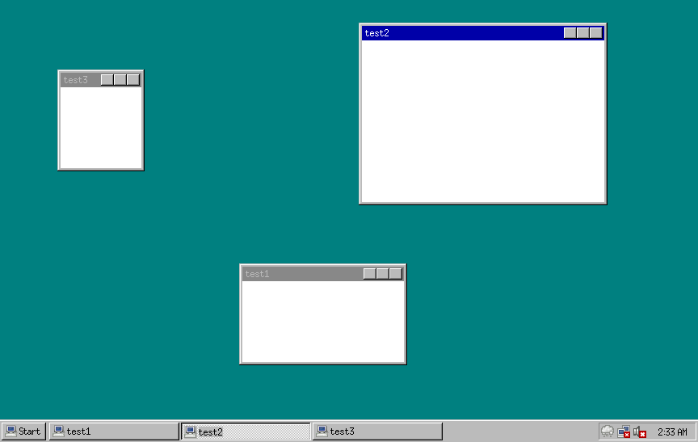

# Tullamore
Tullamore will be a minimalist desktop environment built for embedded Linux systems. 

It is hopped that Tullamore will become the default DE for projects where you aren't even exactly sure you need a GUI.

External libraries are to be kept to an absolute minium. Where a particular tool needs a large library, that tool is to be spun out into its own binary.

